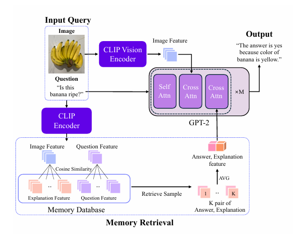

# ReRe
Official Code for **ReRe:Retrieval-Augmented Natural Language Reasoning For Explainable Visual Question Answering** <br>
<br>
Accepted from **IEEE ICIP 2024 workshop: Integrating Image Processing with Large-Scale Language/Vision Models for Advanced Visual Understanding**

Paper: [https://arxiv.org/abs/2408.17006](https://arxiv.org/abs/2408.17006)

<br>
<p align="center">

  </p>

### Requirements
- PyTorch 2.1.2
- CLIP(install with `pip install git+https://github.com/openai/CLIP.git`)
- transformers(install with `pip install transformers`)
- accelerate==0.26.1
- evaluate==0.4.1
- torchvision==0.16.2
- torchmetrics==1.3.0
### Datasets Download
Download the images in `/local_datasets/vqax`
- image for VQA-X: [COCO](https://cocodataset.org/#download) `train2014` and `val2014` images<br>
### Pretrain Model Download
Download GPT-2 distilled model on '/local_datasets/vqax/'. This model is pretrained on image captioning model.
- Model and Tokenizer are in [drive](https://drive.google.com/drive/folders/1diyYSPW4LkdDa0DP9N-Wfx0ulMbOoxiC?usp=drive_link) 
### Code
Train the model using command line below. result of model will be saved in 'result' folder in every epoch.
```bash
python ReRe.py
```
### Evaluation
For evaluate the result of ReRe, We are using Cider, Bleu, Meteor, Rouge, Bertscore to measure the quality of model output explanations. This metrics are widely used metric in NLE Task. For Accuracy, answer's correct or wrong is counted if output answer is in GT answers. To see finetuned model's score, Run the command line below.
```bash
python evaluation.py
```
